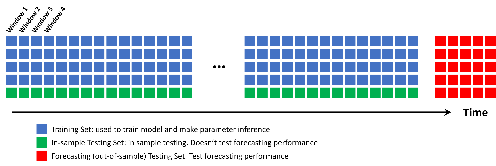

\newcommand{\bP}{\mathbb{P}}
\newcommand{\bE}{\mathbb{E}}
\newcommand{\cD}{\mathcal{D}}

\newcommand{\bbeta}{\bm{\beta}}
\newcommand{\bX}{\bm{X}}

\newcommand{\A}{\mathbf{A}}
\newcommand{\F}{\mathbf{F}}
\newcommand{\R}{\mathbf{R}}
\newcommand{\W}{\mathbf{W}}
\newcommand{\B}{\mathbf{B}}
\newcommand{\balfa}{\bm{\alpha}}
\newcommand{\bx}{\bm{x}}
\newcommand{\ba}{\mathbf{a}}
\newcommand{\bu}{\mathbf{u}}
\newcommand{\bfC}{\mathbf{C}}
\newcommand{\bW}{\bm{W}}
\newcommand{\bepsilon}{\bm{\epsilon}}
\newcommand{\btheta}{\boldsymbol{\theta}}
\newcommand{\bomega}{\boldsymbol{\omega}}
\newcommand{\T}{\boldsymbol{\top}}
\newcommand{\cN}{\mathcal{N}}
\newcommand{\bTheta}{\bm{\Theta}}
\newcommand{\bnu}{\bm{\nu}}
\newcommand{\balpha}{\bm{\alpha}}

```{r load packages, include=F, echo=F}
library(FedData) # Please Install this !!
pkg_test("dplyr")
pkg_test("ggplot2")
pkg_test("TSA")
pkg_test("GGally")
pkg_test("lubridate")
pkg_test("reshape2")
pkg_test("ggcorrplot")
pkg_test("geosphere")
pkg_test("tinytex")
pkg_test("fastDummies")
pkg_test("MASS")
pkg_test("gridExtra")
pkg_test("matrixStats")
pkg_test("MLmetrics")
pkg_test("kableExtra")
pkg_test("bookdown")
pkg_test("tinytex")
#tinytex::install_tinytex() turn this on first time you use it

set.seed(1234)
source("MCMCscript.R")
```


```{r load data, include=FALSE}
raw_1 <- read.csv("./Raw/output_1.csv")
raw_2 <- read.csv("./Raw/output_2.csv")
raw_3 <- read.csv("./Raw/output_3.csv")
raw_4 <- read.csv("./Raw/output_4.csv")
raw_5 <- read.csv("./Raw/output_5.csv")
raw_6 <- read.csv("./Raw/output_6.csv")
raw_7 <- read.csv("./Raw/output_7.csv")
raw_data <- do.call("rbind", list(raw_1,raw_2,raw_3,raw_4,raw_5,raw_6,raw_7))

```


\section{Introduction}

As a major part of the economy, real estate has been constantly and closely monitored by investors and researchers. Since 1970 \href{ https://www.dallasfed.org/-/media/documents/institute/wpapers/2014/0208.pdf }{[1]} when most countries' statistical offices or central banks began to collect data on house prices, interest in predicting and forecasting house prices have gradually augmented, catalyzing out more and more sophisticated modeling techniques. Due to modern society's increased ability to collect and store more data, predicting real estate prices has shifted to data-driven, which further improved modeling precision. 

Being such a sophisticated product, real estate prices are impacted by many factors. While most of the factors helpful in predicting the house are observable and descriptive to the house itself, such as house' size, number of bathrooms, and whether it possesses a swimming pool, etc., there are also not observable factors that also impact house prices, such as the underlying real state market economy, periodicity of real estate prices, and so on. 

Many previous researchers have already proposed multiple ways of predicting and forecasting house prices. From the most simple regression methods as proposed in Kaggle's advanced regression technique blog posts \href{https://www.kaggle.com/manisaurabh/house-prices-advanced-regression-technique }{[2]}, to those that account for repeated sales of houses \href{ https://rady.ucsd.edu/faculty/directory/valkanov/pub/docs/HandRE_GPTV.pdf }{[3]}, and to those that consider temporal effects, such as proposed by Fernando\href{ https://medium.com/@feraguilari/time-series-analysis-modfinalproyect-b9fb23c28309 }{[4]} and Nihar et. al\href{ https://www.ijcaonline.org/archives/volume152/number2/26292-2016911775}{[6]}. Though these studies are drastically different, and research can incorporate more effects to propose more sophisticated models, each study's focus is different and clear. Thus, it is important to make certain of the research question before creating a model.

We propose our goal of this study. We are interested in building an all-in-one model that considers observable house data while also assuming the unobservable temporal effect from the real estate house market. To further narrow down, we are interested in only modeling houses at Durham, NC. Thus, the only type of house that we will be researching is a house in Durham, NC, due to the terrain's better familiarity. There are 4 research questions including 1) how house specific observable, such as number of beds, number of bathrooms, etc. variables affect housing prices, 2) what periodic temporal effects is presented in the past house market, 3) extract past real estate market temporal effects, and 4) making short term forecast of housing prices.


\section{1. Exploratory Data Analysis}
\subsection{1.1 Data description}

The Dataset is scraped from the Redfin official set \href{ https://www.redfin.com/ }{[5]}. Redfin is a real estate brokerage that was founded in 2004. Its website records all of Redfin's historical house purchase in the past 3 years. Therefore, we scraped these 3 years of data recorded for North Carolina, ranging from 2017 April to 2020 May. This dataset contains 6962 observations. Thanks to Redfin's meticulous data management, no missing value in any field was presented. Each observation is a recorded deal of house purchase. Therefore, rather than being subjective such as the seller's one-sided proposed selling price, the price is the real deal price between customer and seller, which is objective enough for us to fit the model on.

The dataset contains many covariates. There are some hard-to-process string information, such as the name of the community, and highly detailed geographical information beyond our interests. Therefore, to simplify our research, we introduce the following covariates of our interest.

\begin{table}[h]
\centering
\begin{tabular}{lllllllll}
\hline 
\textbf{Name}         & \multicolumn{6}{l}{\textbf{Description}}                         & \textbf{Mean}    & \textbf{Standard Deviation} \\ \hline
\texttt{Price}        & \multicolumn{6}{l}{the deal price (dollar) of the house}                  &  319702.000      & 18926.533        \\
\texttt{beds}         & \multicolumn{6}{l}{number of beds in the house}                  &  3.784           & 0.742           \\
\texttt{sold.dat}     & \multicolumn{6}{l}{the date on which the deal is settled}        &  not meaningful  & not meaningful  \\
\texttt{baths}        & \multicolumn{6}{l}{the number of bathrooms the house has}        &  2.825           & 0.661            \\
\texttt{square.feet}  & \multicolumn{6}{l}{usable area (ft$^2$) measured in square feet} &  2437.000        & 907.523          \\
\texttt{lot.size}     & \multicolumn{6}{l}{total area (ft$^2$) of the lot}               &  10275.000       & 1501.712          \\
\texttt{house.age}    & \multicolumn{6}{l}{age (years) of the house when purchased}      &  10.710          & 9.852            \\
\texttt{property.type}& \multicolumn{6}{l}{Condo, Townhouse, or Single-Family residential}      &  not available   & not available   \\
\texttt{latitude}     & \multicolumn{6}{l}{latitude of the house}                        &  35.962          & 0.054          \\
\texttt{longitude}    & \multicolumn{6}{l}{longitude of the house}                       &  -78.861         & 0.061          \\ \hline
\end{tabular}
\caption{Variable of Interests}
\end{table}


\subsection{1.2 Exploring Data}

```{r subset columns and trans Date format, include=F}
onlyDurham <- dplyr::filter(raw_data, city == "Durham")

fieldNames <- c("price", "beds", "sold.dat", "baths", "square.feet", "lot.size", "year.built", "property.type", "latitude", "longitude")
onlyDurham <- onlyDurham[fieldNames]
onlyDurham$log.price <- log(onlyDurham$price)
onlyDurham$date.date <- mdy(onlyDurham$sold.dat)
onlyDurham$house.age <- year(onlyDurham$date.date) - onlyDurham$year.built
```

The first impression is that the distribution of house types in category Condo, Townhouse, and Single Family Residential is highly uneven. This is shown in Appendix figure \ref{fig:uneven class}. Besides, A complete pairwise-plot has also been attached in the Appendix in figure \ref{fig:pair}. The rest of the following section will include 3 subsections explaining the 3 major concerns about data assumption, including suggestions on how to address them. Besides, an additional subsection is also added to explain the engineering of additional predictors and how we address interactions.

```{r property type count bar plot, include=F, fig.width=4, fig.height=2}
house_type <- ggplot(data=onlyDurham, aes(x = property.type, fill=property.type), ) + geom_bar( stat = "count") + theme(axis.title.x = element_blank())
```


```{r Big Pair Plot, include=F, warning=FALSE, eval=T}
numericNamesMask <- unlist(lapply(onlyDurham, is.numeric))
numericNames <- names(onlyDurham)[numericNamesMask]
numericNamesIdx <- which(numericNamesMask)

pairPlot <- ggpairs(onlyDurham, columns=numericNames, 
            aes(color=property.type),
            lower  = list(continuous = wrap("points", alpha = 0.3, size=0.1) ),
            upper  = list(continuous = "blank"),
            diag = list(continuous = "densityDiag", discrete = "barDiag", na = "naDiag") ) 


for (i in 1:length(numericNamesIdx)) {

  # Address only the diagonal elements
  # Get plot out of plot-matrix
  inner <- getPlot(pairPlot, i, i);

  # Add ggplot2 settings (here we remove gridlines)
  inner <- inner + theme(panel.grid = element_blank()) +
    theme(axis.text.x = element_blank())

  # Put it back into the plot-matrix
  pairPlot <- putPlot(pairPlot, inner, i, i)

  for (j in 1:length(numericNamesIdx)){
    if((i==1 & j==1)){

      # Move the upper-left legend to the far right of the plot
      inner <- getPlot(pairPlot, i, j)
      inner <- inner + theme(legend.position=c(length(numericNamesIdx)-0.25,0.50)) 
      pairPlot <- putPlot(pairPlot, inner, i, j)
    }
    else{

      # Delete the other legends
      inner <- getPlot(pairPlot, i, j)
      inner <- inner + theme(legend.position="none")
      pairPlot <- putPlot(pairPlot, inner, i, j)
    }
  }
}


```

\subsubsection{1.2.1 Multi-collinearity}

The number of bathrooms of the house has a very strong linear correlation with the total square feet the house has. Notice that in figure 1.2.1 below, strong collinearity is shown between the number of baths and square feet of the house, achieving a correlation of 0.7843. Though they're not high enough for us to concern about identifiability issues, we should still be careful in the final model output for these highly correlated covariates. More pairwise relationships between variables can be found in the pair plot shown in Appendix at figure \ref{fig:pair}

```{r Collinearity, echo=F, fig.align="center", fig.height=2.5, fig.width=5}
# cor(onlyDurham$baths, onlyDurham$square.feet)
Collinearity <- ggplot(onlyDurham, aes(x=baths, y=square.feet)) + 
                      geom_point(aes(color=property.type), alpha=0.2) + labs(caption = "Figure 1.2.1", title = "Number of Beds comparing with total square feet of the house")
Collinearity
```

\subsubsection{1.2.2 Heteroscedasticity}

Apart from some strong collinearity and high correlation between covariates, heteroscedasticity is also evident in this dataset. We found that the increase in these predictors' values and response value leads to increased variance. Surely enough, bigger and more expensive houses exhibit greater variation in price. This violates the linear regression homoscedasticity assumption, as shown in figure 1.2.2 below. To address this, we perform log-transformation on the response variable and create a final regression response variable `log.price,` which is the logarithm of the house deal price. As shown in the last line of the pair plot, the Heteroscedasticity problem is resolved without harming the response and predictors' linear relationship. It has also made some linear relationships more evident.

```{r Heteroskedasticity, echo=F, warning=F, fig.align = 'center',fig.height=3.5, fig.width=8}

bed_price <- ggplot(onlyDurham, aes(x=beds, y=price, color = property.type)) + 
             geom_point(alpha=0.2) +
             geom_smooth(method="nls",
                         formula = y ~ a * x+b, se = F,
                         method.args = list(start = list(a = 0.1, b = 0.1)) ) + 
             theme(legend.position="none") + 
              ggtitle("before log transformation")+ 
              labs(caption = "Figure 1.2.2 (b)")


bed_log.price <- ggplot(onlyDurham, aes(x=beds, y=log.price, color = property.type)) + 
                geom_point(alpha=0.2, aes(color=property.type)) +
             geom_smooth(method="nls",
                         formula = y ~ a * x+b, se = F,
                         method.args = list(start = list(a = 0.1, b = 0.1)) ) + 
                theme(legend.position="top") + 
              ggtitle("After log transformation")+ 
              labs(caption = "Figure 1.2.2 (b)")

gridExtra::grid.arrange(bed_price, bed_log.price, ncol=2, top="Salce Price by # bedrooms before and after log transformation")

```

\subsubsection{1.2.3 Stationarity}

When determining what model to capture the temporal effect, it is imperative to verify whether the stationarity assumption has been satisfied. In our case, due to the fact it is unlikely that there are houses sold each day, we need to construct the time series by windowing the raw data -- that is, we treat all the real estate deals that happened in a time window as deals happening at the same timestep. By specifying our window's width, we can modulate and balance between flexibility in temporal effect and validity of regression coefficients. At this point, we choose window width to be 15 days.


```{r make windowed data, include=F, warning=F}
win_size = 15
onlyDurham <- onlyDurham[order(onlyDurham$date.date),]
begin <- min(onlyDurham$date.date)
end <- max(onlyDurham$date.date)
windowGrid <- seq(begin, end, win_size)

win_ex <- list()
win_log.price <- list()
win_mean.price <- c()
win_mid_date <- c()

onlyDurham$win.date = 0
for(i in 1:(length(windowGrid)-1) )
{
  win_start= windowGrid[i]
  win_end  = windowGrid[i+1]
  win_data = filter(onlyDurham, date.date >= win_start)
  win_data = filter(win_data, date.date <  win_end)
  
  win_ex[[i]] <- win_data
  win_log.price[[i]] <- win_data$log.price
  mid_date <- win_start + floor((win_start - win_end )/2)
  win_mid_date[i] <- mid_date
  win_mean.price[i] <- mean(win_data$log.price)
  onlyDurham$win.date <- ifelse(between(onlyDurham$date.date, win_start, win_end), 
                                format.Date(mid_date), onlyDurham$win.date)
}

```

```{r stationarity plot, echo=F, warning=F, fig.align = 'center',fig.height=2, fig.width=8}
lables = seq(begin, end, 30)

ggplot(data=onlyDurham, aes(group=win.date, y=log.price)) + theme(legend.position = "none") +
        geom_boxplot( aes(fill=win.date), outlier.shape = NA) +
        scale_y_continuous(limits = quantile(onlyDurham$log.price, c(0.005, 0.99))) +
        scale_x_date(breaks = lables) +
  labs(title = "log price at each time window", x= "time window", y = "log price",caption="Figure 1.3.2 (a)")

```

Under the 15-day window size, from figure 1.3.2 (a), we learn that there is a slight upward trend in the distribution of the logarithm of house prices through time. Though this figure can only show the distribution of log price marginalized out by all other exogenous variables, it is helpful for us to identify a linearly increasing time trend. Facing the slightly non-stationarity upward trend, we propose 2 model choices: 1) ignore (no trend model), 2) adding variable `sold.dat`, the sold date, into the linear observation model as a predictor in order to capture the linear trend using the linear model (linear trend model). We will fit these 2 models and determine the final model by checking their performance and validation results.

Besides, it would also help identify the number of lags $p$ by 1) checking autocorrelation and partial autocorrelation (ACF/PACF) plots and 2) making a hypothesis. Below in figure 1.3.2 (b) shows the ACF/PACF plot mentioned. We observe that lag 1,2,3 are statistically significantly correlated. Therefore, we should at least propose have $p\geq 3$. However, as we also hold the hypothesis that house prices might perform cycles of a very long period, we further extend $p\geq 12$ given that a window is now defined to be 15 days. Therefore, we will start by incorporating 12 auto-correlation terms in our model. Due to the excess amount of lags, we will design Bayesian ridge shrinkage for AR(p) coefficients. Details are fully explained in Appendix section A.


```{r ggplot PACF plot func, include=F, warning=F}
ggplot.corr <- function(data, lag.max = 24, ci = 0.95, large.sample.size = TRUE, horizontal = TRUE,...) {
  
  require(ggplot2)
  require(dplyr)
  require(cowplot)
  
  if(horizontal == TRUE) {numofrow <- 1} else {numofrow <- 2}
  
  list.acf <- acf(data, lag.max = lag.max, type = "correlation", plot = FALSE)
  N <- as.numeric(list.acf$n.used)
  df1 <- data.frame(lag = list.acf$lag, acf = list.acf$acf)
  df1$lag.acf <- dplyr::lag(df1$acf, default = 0)
  df1$lag.acf[2] <- 0
  df1$lag.acf.cumsum <- cumsum((df1$lag.acf)^2)
  df1$acfstd <- sqrt(1/N * (1 + 2 * df1$lag.acf.cumsum))
  df1$acfstd[1] <- 0
  # df1 <- select(df1, lag, acf, acfstd)
  
  list.pacf <- acf(data, lag.max = lag.max, type = "partial", plot = FALSE)
  df2 <- data.frame(lag = list.pacf$lag,pacf = list.pacf$acf)
  df2$pacfstd <- sqrt(1/N)
  
  if(large.sample.size == TRUE) {
    plot.acf <- ggplot(data = df1, aes( x = lag, y = acf)) +
    geom_area(aes(x = lag, y = qnorm((1+ci)/2)*acfstd), fill = "#B9CFE7") +
    geom_area(aes(x = lag, y = -qnorm((1+ci)/2)*acfstd), fill = "#B9CFE7") +
    geom_col(fill = "#4373B6", width = 0.7) +
    scale_x_continuous(breaks = seq(0,max(df1$lag),6)) +
    scale_y_continuous(name = element_blank(), 
                       limits = c(min(df1$acf,df2$pacf),1)) +
    ggtitle("ACF") +
    theme_bw()
    
    plot.pacf <- ggplot(data = df2, aes(x = lag, y = pacf)) +
    geom_area(aes(x = lag, y = qnorm((1+ci)/2)*pacfstd), fill = "#B9CFE7") +
    geom_area(aes(x = lag, y = -qnorm((1+ci)/2)*pacfstd), fill = "#B9CFE7") +
    geom_col(fill = "#4373B6", width = 0.7) +
    scale_x_continuous(breaks = seq(0,max(df2$lag, na.rm = TRUE),6)) +
    scale_y_continuous(name = element_blank(),
                       limits = c(min(df1$acf,df2$pacf),1)) +
    ggtitle("PACF") +
    theme_bw()
  }
  else {
    plot.acf <- ggplot(data = df1, aes( x = lag, y = acf)) +
    geom_col(fill = "#4373B6", width = 0.7) +
    geom_hline(yintercept = qnorm((1+ci)/2)/sqrt(N), 
               colour = "sandybrown",
               linetype = "dashed") + 
    geom_hline(yintercept = - qnorm((1+ci)/2)/sqrt(N), 
               colour = "sandybrown",
               linetype = "dashed") + 
    scale_x_continuous(breaks = seq(0,max(df1$lag),6)) +
    scale_y_continuous(name = element_blank(), 
                       limits = c(min(df1$acf,df2$pacf),1)) +
    ggtitle("ACF") +
    theme_bw()
    
    plot.pacf <- ggplot(data = df2, aes(x = lag, y = pacf)) +
    geom_col(fill = "#4373B6", width = 0.7) +
    geom_hline(yintercept = qnorm((1+ci)/2)/sqrt(N), 
               colour = "sandybrown",
               linetype = "dashed") + 
    geom_hline(yintercept = - qnorm((1+ci)/2)/sqrt(N), 
               colour = "sandybrown",
               linetype = "dashed") + 
    scale_x_continuous(breaks = seq(0,max(df2$lag, na.rm = TRUE),6)) +
    scale_y_continuous(name = element_blank(),
                       limits = c(min(df1$acf,df2$pacf),1)) +
    ggtitle("PACF") +
    theme_bw()
  }
  cowplot::plot_grid(plot.acf, plot.pacf, nrow = numofrow)
}
```

```{r PACF store plot, include=F, fig.height=2, fig.width=6, warning=F}
temp <- ggplot.corr(data = win_mean.price, lag.max = 25, ci= 0.95, large.sample.size = FALSE, horizontal = TRUE)+ 
              labs(caption = "Figure 1.2.3 (b)")
```

```{r Plot PACF, echo=F, fig.height=2, fig.width=6,fig.align = 'center', warning=F}
temp
```


\subsubsection{1.2.4 Engineered Feature and Interaction}

We hypothesize that an excessive number of beds in a house with a comparatively low number of bathrooms can impact house prices. Therefore, we created the variable `room.Diff`, which means how much more bathrooms the house has than beds. We found such feature creates distinct effects across Single Family Residential, Townhouse, and Condo in affecting log of price. In figure 1.2.4 (a), we can observe a different slope of the variable for 3 types of houses. Therefore, together with `room.Diff`, interactions between the bed-bath difference and house type should also be added to our model.

Lastly, we believe that incorporating a simple distance to Duke covariable can increase prediction power, as we are modeling house prices at Durham. Therefore, we engineered the new variable `dist.duke`, indicating the house's road distance to Duke. This is calculated by a package called `mapdist`. It has a full map of the US. .  By drawing the shortest route between 2 addresses, the package calculates their road distances. Such an address is inferred from latitude and longitude. The package will locate the street closest to the given longitude and latitude. We use this procedure to calculate road distances between each house and Duke. Then, as figure 1.2.4 (b) shows, aligned with our conjecture, we anticipate a longer distance to Duke, leading to a lower housing price.


```{r Interaction and bed difference, echo=F, warning=F, fig.height=3, fig.width=8,fig.align = 'center', message=F}
onlyDurham$room.Diff <- onlyDurham$baths - onlyDurham$beds

interactionplot <- ggplot(data = onlyDurham, aes(x=room.Diff, y=log.price, color=property.type)) + 
  geom_point(alpha=0.8, size=1) +
  geom_smooth(method="nls",
              formula = y ~ a * x+b, se = F,
              method.args = list(start = list(a = 0.1, b = 0.1)) ) + 
              theme(legend.position="top",legend.text=element_text(size=8), 
                    legend.title=element_blank(), plot.title = element_text(size=12)) + ggtitle("bath/bed difference and house type interaction") + 
              labs(caption = "Figure 1.2.4 (a)")
Duke <- c(36.0014, -78.9382)
onlyDurham$dist.duke <- distm(cbind(onlyDurham$latitude, onlyDurham$longitude), Duke , fun = distHaversine)
distanceplot <- ggplot(data = onlyDurham, aes(x=dist.duke, y=log.price)) + 
  geom_point(alpha=0.8, size=1) +
  geom_smooth(method = lm) + theme(legend.position="top") + ggtitle("Distance to Duke") + 
              labs(caption = "Figure 1.2.4 (b)")

gridExtra::grid.arrange(interactionplot, distanceplot, ncol=2)

```


\section{2 Model Formulation}

We define our model as a regression model on top of an AR(p) model. After EDA, we determine response to be the logarithm of the house deal price. The predictors are the number of beds, the number of bathrooms, total square feet of the house, the entire size of the lot, house's age, the type of the house (condo, single-family residential, or townhouse), the difference between beds and bathrooms, distance to Duke, sold date (plus 1 for 1 day later), and finally interaction between house type and the bed-bath difference. Besides, we define the intercept $\alpha_t$ as the time-varying not observable "market effect." The transition of $\alpha_t$ follows an AR(p) process. Therefore, the full model is defined as below. (\textbf{Note:} This model has incorporated sold date as a predictor. This corresponds to the linear trend model mentioned in EDA 1.2.3 about stationarity. To construct the ignore trend model, remove sold date together with its $\beta$ coefficient)

\begin{align}
    \log(\text{house price})^{(i)} &= y_t^{(i)}\\
    &= 
    \beta_{\text{beds}}\textbf{ beds}_t^{(i)} + \beta_{\text{sold date}}\textbf{ sold date}_t^{(i)} + \beta_{\text{beds}}\textbf{ baths}_t^{(i)}  + \\
    &\quad \beta_{\text{lot size}}\textbf{ lot size}_t^{(i)} + \beta_{\text{house age}}\textbf{ house age}_t^{(i)}+ \\
    &\quad \beta_{\text{room difference}}\textbf{ room Diff}_t^{(i)}+ \beta_{\text{dist. to Duke}}\textbf{ dist. to Duke}_t^{(i)}+ \\
    &\quad \beta_{\text{square feet}}\textbf{ square feet}_t^{(i)} + \beta_{\text{property type}} \textbf{ property type}_t^{(i)} + \\
    &\quad \beta_{\text{interaction}}\textbf{ room Diff}_t^{(i)}\times \textbf{property type}_t^{(i)} + \alpha_t + \nu_{t}^{(i)}\\
    \alpha_t &= \sum_{i=1}^p \theta_i \alpha_{t-i} + \omega_t \\
    \omega_t &\sim \cN(0, w)\\
    \nu_{t}^{(i)} &\sim \cN(0, v)
\end{align}

Where logarithm of deal price, denoted as $y_{t}^{(i)}$, is the response of the $i^{th}$ ($i \in \{1,2,3 \cdot n_t\}$) house sold on the $t^{th}$ timestep (window). (note: suppose for each window $t \in \{1,2,3,\cdots, T\}$, there are $n_t$ sold houses in the $t^{th}$ window. Then $n_t$ need not be equal for all $t$). The rests are predictive variables. $\alpha_t$ is an time varying intercept which will be modeled by the AR($p$) model described in $(5), (6)$. $\nu_{t}^{(i)}$ is an additional observation uncertainty and $\omega_t$ is an additional evolution uncertainty. To simply our modeling process, we take $\nu_t^{(i)}$, $\omega$ to have constant variance at all time.

Through reparametrization, we can simplify the model as the following. A detailed explanation of why we should formulate the model in this compact form is due to inference. A detailed explanation can be found in Appendix B.

\begin{align*}
    \balfa_t &= \bTheta\balfa_{t-1} + \bm{W}_t\\
    \bm{y}_{t} &= \bm{1} \balfa_t + \bbeta \bX_t + \bnu_t\\
    \bm{W}_t &\sim \cN(\bm{0} , w\bm{I})\\
    \bnu_t &\sim \cN(\bm{0}, v\bm{I}) \\
    \bm{1} := 
    \begin{bmatrix}
    1& 0& 0& 0& 0\\
    1& 0& 0& 0& 0\\
    1& 0& 0& 0& 0\\
    \vdots& \vdots& \vdots& \vdots& \vdots\\
    1& 0& 0& 0& 0\\
    \end{bmatrix}
    &\quad 
    \bm{\alpha}_t := 
    \begin{bmatrix}
    \alpha_t\\
    \alpha_{t-1}\\
    \alpha_{t-2}\\
    \vdots\\
    \alpha_{t-p}\\
    \end{bmatrix}
    = 
    \begin{bmatrix}
    \theta_1&\theta_2   &\theta_3   &\dots  &\theta_p\\
    1       &0          &0          &\dots  &0      \\
    0       &1          &0          &\dots  &0      \\
    \vdots  & \vdots    & \vdots    &\vdots &\vdots\\
    0       &0          &0          &\dots  &0      \\
    \end{bmatrix}
    \begin{bmatrix}
    \alpha_{t-1}\\
    \alpha_{t-2}\\
    \alpha_{t-3}\\
    \vdots\\
    \alpha_{t-p}\\
    \end{bmatrix}
    =
    \bTheta \balfa_{t-1}\\\\
    \balpha_0 &\sim \cN(\bm{0}, \bm{I})\\
    \bbeta \mid (\tau=v^{-1}), \kappa & \sim \mathrm{N}\left(\mathbf{0}, \bm{I}(\tau \kappa)^{-1}\right) \\
    p( (\tau=v^{-1}) \mid \kappa) & \propto 1 / \tau \\
    \kappa &\sim \bm{G}(1/2, 1/2)\\
    \btheta | (\phi = w^{-1}), \cD_T, \bbeta, v &\sim \mathcal{N}\left(\boldsymbol{\mu}_{0}, \boldsymbol{\Lambda}_{0}^{-1} /    \phi\right) = \cN((\frac{1}{p}, \frac{1}{p}, \cdots, \frac{1}{p})^T, \frac{1}{p} \phi^{-1}\mathbf{I})\\
    (\phi = w^{-1}) | \cD_T, \bbeta, v &\sim \mathbf{G}\left(a_0 = \frac{v_{0}}{2}, b_0 = \frac{v_0 s_0^2}{2}  \right) = \mathbf{G}\left(\frac{1}{2}, \frac{1}{2} \right)\\
\end{align*}


\section{3 Methodology}

This section explores the methodology of using MCMC sampling with the forward-backward algorithm to make inference on parameters. Besides, we will also discuss how the methodology and the inferred parameter posterior distribution could answer our pre-stated 4 research questions in the introduction. 

The Model requires making statistical inference of the following parameters: $\{w, v, \bbeta, \btheta, \balpha_{1:T}\}$, where $T$ is the last timestep index. To obtain these, we choose to apply MCMC sampling with the forward-backward algorithm within the MCMC sampler. In Appendix F and below is the algorithm that returns MCMC samples for these parameters. A highly detailed derivation of each step's sampling distribution can be found in appendix A. Notice that to apply MCMC, we must design a prior distribution for all the parameters. Due to the flexibility of prior design and our previous sections stated multicollinearity problem, we have decided to propose Bayesian Ridge regression priors for both the AR($p$) coefficients $\btheta$ and also the linear regression model $\bbeta$ coefficients. Details can also be found in Appendix A. From now on, denote $\cD_t := \{\bm{X}_{1:t},\bm{y}_{1:t}\}$, all the information in the observed data from initial time to time $t$.

We have proposed 4 research questions at the end of the introduction section. A detailed explanation of how our inferred parameters will address each research question has been included in Appendix F subsection F.1. 


\begin{algorithm}[H]
\SetAlgoLined
\KwResult{Sampling distribution for $\{w, v, \bbeta, \btheta, \balpha_{1:T}\}$}
\textbf{Initialize}: $\bP((\theta_1, \dots, \theta_p)^\top ), \bP(w), \bP(v)$ via pre-set prior distribution \\
\While{not converged}
 {
    \textbf{Calculate}: posterior mean and covariance for $\balpha_{t} | \cD_t$: $m_{t}, C_{t}$ $\forall t \in {1: T}$ via forward filtering algorithm in Appendix \\
    \textbf{Sample}: $\balpha_{t} | \cD_T$ from $m_{t}^*, C_{t}^*, \forall t \in {1: T}$ by backward smoothing\\
    \textbf{Sample}: $\btheta ,(\phi = w^{-1}) | \bX, \cD_T, \bbeta$ by first sampling $(\phi = w^{-1}) | \bX, \cD_T, \bbeta$ and then $\btheta | \bX, \cD_T, \bbeta, \phi$ \\
    \textbf{Sample}: $\bbeta ,(\tau = v^{-1}) | \bX, \cD_T, \btheta$ by first sampling $(\tau = v^{-1}) | \bX, \cD_T, \btheta$ and then $\bbeta | \bX, \cD_T, \btheta, \tau$
 }
\textbf{Return}: samples of $w, v, \bbeta, \btheta_{1:T}$
\caption{parameter inference algorithm}
\end{algorithm}


<!-------------------------------------------MODELING--------------------------------------------->
<!-------------------------------------------MODELING--------------------------------------------->
<!-------------------------------------------MODELING--------------------------------------------->

\section{4 Validation and Results}


\subsection{4.1 Model Validation}

To validate the model, we have developed a 3 way splitting of total data, which includes 1) the training set, 2) the in-sample testing set, and 3) the (out-of-sample) forecast testing set. Explicitly, using 15 days as the size of the window, there are 75 windows of data. To obtain the forecast testing set, we take the last 5 windows of data, incorporating 239 observed house deals, as our forecast testing set. After we trained our model using the training set of data, we will forecast these 5 windows of data to test our out-of-sample model forecasting performance. To obtain the in-sample testing set, we randomly pick 20$\%$ of house deal observation from each of the first 70 windows, incorporating 537 observed house deals, to form the in-sample testing set. The rest of the data forms the training set. We make inferences on parameters based on the training set and predict the in-sample testing set. Such an error is the in-sample prediction error. In short, we will validate both the in-sample prediction mean absolute error (MAE) and also the out-of-sample forecast MAE, and we expect the latter to be slightly greater than the former. Such a validation result is in Table 5 of Appendix C.4. We observe that in-sample prediction error is smaller for both no trend and linear trend model. Nevertheless, the out-of-sample error increased more for the no trend model compared to the linear trend model, denoting that the no trend model is not doing as well in forecast as and the linear trend model. This is just as anticipated. However, generally, the MAE of both models is still acceptable, as the error of predicting and forecasting house prices is usually not going beyond 500 dollars. An illustration of the data split is shown below.




```{r calculate cycle and period, include=F}
calPeriod <- function(eigens){
  periods <- c()
  modulus <- c()
  for(i in 1:length(eigens))
  {
    if( is.complex(eigens[i] )){
      moduli <- Mod(eigens[i])
      modulus <- append(modulus,  moduli)
      period <- 2*pi /asin( Im(eigens[i]/moduli   ) )
      periods <- append(periods, abs(period))
      } 
  }
  result <- data.frame(modulus, periods)  
  result <- na.omit(result)
  result <- unique(result)
  result <- result[is.finite(rowSums(result)),]
  return(result)
}
```

\subsection{4.2 Model Results}

Just as the model itself suggests, we have an abundance of results. For the first research questions, the modeling results are all in Table 3 in Appendix C. Interpretations are the same as that of the linear model. For instance, holding all else constant, having 1 more bed in the same house will make the median of the house price decrease to $e^{-0.13}$ multiplicative factor, which is about 89.34 percent; holding all else constant, having 1 more bathroom will make the median of the house price increase to $e^{0.21}$ multiplicative factor, which is 123.36 percent. Interaction terms can also be interpreted. For example, holding all else constant, if a house is a townhouse, then having even one more bed than bathroom will make the median of the house to decrease to $e^{0.415 - 0.599}$ multiplicative factor, which is reduced to the surprising 0.5627 percent. However, if the house is a single-family house, then having even one more bed than the bathroom will make the house's median to decrease to $e^{0.415 - 0.550}$ multiplicative factor, which is reduced to 87.37 percent. Lastly, for the linear trend model, we want to speak for the `sold.dat` coefficient. For the same house, regardless of market periodicity, we expect the house to be sold at $e^{0.0001387} = 100.0139\%$ its price the day before. To provide a better idea of annual house market inflation, we expect the same house to be sold $5.17\%$ more expensive than it was in the last year (calculated without taking consideration of amortization. Aka. not taking account of the increase of the house age variable `house.age`), which is than twice of the federal reserve rate. For houses in a city like Durham, this surely is a very reasonable estimate. Due to the page limit, we only show some examples in this section. Complete interpretation can be found in Appendix C.1 below Table 3.

The second model result is about house market periodicity. From Table 4 in Appendix C.2, we learn that the housing market shows 2-month, 4-month, annual, and seasonal periodicity, with the order from the most significant to the least significant. I conjecture that 4 months is the Duke university semester cycle, with the spring semester, summer, and fall semester nearly equally partitioning the entire school year. Therefore, it is reasonable that house prices may adjust with this 4-month cycle. The 2-month cycle might also be part of the 4-month periodicity as the periodicity need not be of a standard sine wave. The annual and seasonal periodicity is very intuitive as it is common sense that there could be seasonal business cycles and the annual economic cycle that impacts the house price.

Our result for research question 3, the market movement, can be found in Appendix C.3, and our final forecasts are in Appendix C.4 Table 5, which has already been discussed in model validation section 4.1.


<!-------------------------------------------NO TREND--------------------------------------------->

```{r make model data no trend, include=F}

model_data_raw <- onlyDurham
model_data_raw$sold.dat <-  as.numeric(mdy(onlyDurham$sold.dat))
model_data_raw$single <- ifelse(model_data_raw$property.type == "Single Family Residential",1,0)
model_data_raw$townhouse <- ifelse(model_data_raw$property.type == "Townhouse",1,0)
model_data_raw$itr_townhouse <- model_data_raw$townhouse * model_data_raw$room.Diff
model_data_raw$itr_single <- model_data_raw$single * model_data_raw$room.Diff

fieldNames <- c("beds", "sold.dat", "baths", "square.feet", "lot.size", "house.age", "single", "townhouse", "room.Diff", "dist.duke", "itr_townhouse", "itr_single")

model_data_raw <- model_data_raw[fieldNames]

model_data_raw <- scale(model_data_raw)
center <- as.data.frame( t(attr(model_data_raw,"scaled:center")) )
scales_notrend <- as.data.frame( t(attr(model_data_raw,"scaled:scale")) )
model_data_raw <- as.data.frame(model_data_raw)
model_data_raw$log.price <-  onlyDurham$log.price


date_scaler <- scales_notrend$sold.dat

win_size <- 15
scaled_win_size <- win_size / date_scaler
begin <- min(model_data_raw$sold.dat)
end <- max(model_data_raw$sold.dat)
windowGrid <- seq(begin, end, scaled_win_size)


win_X <- list()
win_Y <- list()
win_mid_date <- c()


for(i in 1:(length(windowGrid)-1) )
{
  win_start= windowGrid[i]
  win_end  = windowGrid[i+1]
  win_data = filter(model_data_raw, sold.dat >= win_start)
  win_data = filter(win_data, sold.dat <  win_end)

  win_X[[i]] <- data.matrix(win_data[, -which(names(win_data) %in% c("sold.dat", "log.price"))])
  win_Y[[i]] <- data.matrix(win_data$log.price)
  mid_date <- win_start + floor((win_start - win_end )/2)
  win_mid_date[i] <- mid_date
}


n <- length(win_X)
pred_step <- 1

train_win_X <- win_X[c(1:(n-pred_step))]
train_win_Y <- win_Y[c(1:(n-pred_step))]
train_win_mid_date <- win_mid_date[c(1:(n-pred_step))]
test_win_X <- win_X[c((n-pred_step+1):n)]
test_win_Y <- win_Y[c((n-pred_step+1):n)]
train_win_mid_date <- win_mid_date[c((n-pred_step+1):n)]


n_train <- length(train_win_X)
n_test <- length(test_win_X)
print(n_train)
print(n_test)


```

```{r start-MCMC-notrend, include=F, results='hide'}
total_itr = 60000  #1000000
kappa = 0.1
p = 12
take <- 1000  #1000
longer_no_trend <- 6065
longer_linear_trend <- 16041

results_notrend <- MCMC_noBlock(train_win_X, train_win_Y, test_win_X, test_win_Y, p, total_itr, kappa, take)
record_thetas <-as.data.frame(results_notrend$record_thetas)
record_betas <- as.data.frame(results_notrend$record_betas)
record_alphas <- as.data.frame(results_notrend$record_alphas)
record_ws <- as.data.frame(results_notrend$record_ws)
record_vs <- as.data.frame(results_notrend$record_vs)
record_mse <- as.data.frame(results_notrend$record_mse)
record_res <- as.data.frame(results_notrend$record_res)

thetas_mean <- as.matrix(colMeans(as.matrix(record_thetas)))

record_thetas$itr <- seq.int(nrow(record_thetas))
record_betas$itr <- seq.int(nrow(record_betas))
record_alphas$itr <- seq.int(nrow(record_alphas))
record_ws$itr <- seq.int(nrow(record_ws))
record_vs$itr <- seq.int(nrow(record_vs))

```


```{r Cyclicality-no-trend, include=F, warning=F}
jordan_mtx <- cbind(diag(p-1), rep(0, p-1))
bTHETA_mean <- rbind(t(thetas_mean), jordan_mtx)

periocity_notrend <- calPeriod(eigen(bTHETA_mean)$values)
periocity_notrend$period_in_day <- periocity_notrend$periods * win_size
rownames(periocity_notrend) <- 1:nrow(periocity_notrend)
```

```{r market traj, include=F, warning=F}
toplot_alphas <- record_alphas[, -which(names(record_alphas) == "itr")]
market_traj_notrend <- ggplot(data=melt(toplot_alphas), aes(x=variable, y=value)) + theme(legend.position = "none") +
                        geom_boxplot(outlier.shape = NA) +
                        labs(title = "market level vs time - no trend", x= "time window", y = "log price") +
                        scale_x_discrete(breaks = lables)
```


<!-------------------------------------------LINEAR TREND--------------------------------------------->

```{r make model data with sold dat, include=F}

model_data_raw <- onlyDurham
model_data_raw$sold.dat <-  as.numeric(mdy(onlyDurham$sold.dat))
model_data_raw$single <- ifelse(model_data_raw$property.type == "Single Family Residential",1,0)
model_data_raw$townhouse <- ifelse(model_data_raw$property.type == "Townhouse",1,0)
model_data_raw$itr_townhouse <- model_data_raw$townhouse * model_data_raw$room.Diff
model_data_raw$itr_single <- model_data_raw$single * model_data_raw$room.Diff

fieldNames <- c("beds", "sold.dat", "baths", "square.feet", "lot.size", "house.age", "single", "townhouse", "room.Diff", "dist.duke", "itr_townhouse", "itr_single")

model_data_raw <- model_data_raw[fieldNames]

model_data_raw <- scale(model_data_raw)
center <- as.data.frame( t(attr(model_data_raw,"scaled:center")) )
scales_linearTrend <- as.data.frame( t(attr(model_data_raw,"scaled:scale")) )
model_data_raw <- as.data.frame(model_data_raw)
model_data_raw$log.price <-  onlyDurham$log.price

date_scaler <- scales_linearTrend$sold.dat

win_size <- 15
scaled_win_size <- win_size / date_scaler
begin <- min(model_data_raw$sold.dat)
end <- max(model_data_raw$sold.dat)
windowGrid <- seq(begin, end, scaled_win_size)


win_X <- list()
win_Y <- list()
win_mid_date <- c()


for(i in 1:(length(windowGrid)-1) )
{
  win_start= windowGrid[i]
  win_end  = windowGrid[i+1]
  win_data = filter(model_data_raw, sold.dat >= win_start)
  win_data = filter(win_data, sold.dat <  win_end)

  win_X[[i]] <- data.matrix(win_data[, -which(names(win_data) %in% c("log.price"))])
  win_Y[[i]] <- data.matrix(win_data$log.price)
  mid_date <- win_start + floor((win_start - win_end )/2)
  win_mid_date[i] <- mid_date
}


n <- length(win_X)
pred_step <- 1

train_win_X <- win_X[c(1:(n-pred_step))]
train_win_Y <- win_Y[c(1:(n-pred_step))]
train_win_mid_date <- win_mid_date[c(1:(n-pred_step))]
test_win_X <- win_X[c((n-pred_step+1):n)]
test_win_Y <- win_Y[c((n-pred_step+1):n)]
train_win_mid_date <- win_mid_date[c((n-pred_step+1):n)]


n_train <- length(train_win_X)
n_test <- length(test_win_X)
print(n_train)
print(n_test)

```

```{r start-MCMC with sold dat, include=F}
kappa = 0.1

results_linearTrend <- MCMC_noBlock(train_win_X, train_win_Y, test_win_X, test_win_Y, p, total_itr, kappa, take)
record_linearTrend_thetas <-as.data.frame(results_linearTrend$record_thetas)
record_linearTrend_betas <- as.data.frame(results_linearTrend$record_betas)
record_linearTrend_alphas <- as.data.frame(results_linearTrend$record_alphas)
record_linearTrend_ws <- as.data.frame(results_linearTrend$record_ws)
record_linearTrend_vs <- as.data.frame(results_linearTrend$record_vs)
record_linearTrend_mse <- as.data.frame(results_linearTrend$record_mse)
record_linearTrend_res <- as.data.frame(results_linearTrend$record_res)

thetas_linearTrend_mean <- as.matrix(colMeans(as.matrix(record_linearTrend_thetas)))

record_linearTrend_thetas$itr <- seq.int(nrow(record_linearTrend_thetas))
record_linearTrend_betas$itr <- seq.int(nrow(record_linearTrend_betas))
record_linearTrend_alphas$itr <- seq.int(nrow(record_linearTrend_alphas))
record_linearTrend_ws$itr <- seq.int(nrow(record_linearTrend_ws))
record_linearTrend_vs$itr <- seq.int(nrow(record_linearTrend_vs))

```


```{r Cyclicality-no-with sold dat, include=F, warning=F}
jordan_mtx <- cbind(diag(p-1), rep(0, p-1))
bTHETA_mean <- rbind(t(thetas_linearTrend_mean), jordan_mtx)

periocity_linearTrend <- calPeriod(eigen(bTHETA_mean)$values)
periocity_linearTrend$period_in_day <- periocity_linearTrend$periods * win_size

rownames(periocity_linearTrend) <- 1:nrow(periocity_linearTrend)
```

```{r market traj with sold dat, include=F, warning=F}
toplot_alphas <- record_linearTrend_alphas[, -which(names(record_linearTrend_alphas) == "itr")] + unique(model_data_raw$sold.dat) * mean(record_linearTrend_betas$sold.dat)
market_traj_linearTrend <- ggplot(data=melt(toplot_alphas), aes(x=variable, y=value)) + theme(legend.position = "none") +
                        geom_boxplot(outlier.shape = NA) +
                        labs(title = "market level vs time - linear trend", x= "time window", y = "log price")+
                        scale_x_discrete(breaks = lables)
```

<!-------------------------------------------LOCALLY LINEAR--------------------------------------------->


\section{5 Diagnostic and Sensitivity Analysis}

\subsection{5.1 Model Diagnostics}

Our diagnostic procedure for model diagnostics is 2-fold since the model is essentially a combination of 2 models, the linear observation model, and the time-series evolution model. Thus, diagnostics should evaluate whether assumptions for both models are met.

For the linear observation model, we have plotted the residual plot of linear regression. In Appendix D.1 figure \ref{fig:res no trend} and D.2 figure \ref{fig:res linear}, the x-axis represents index of the houses observations. We observe that all of them have constant variance, centered at zero, homoskedastic, and are Gaussian distributed. Thus, the assumption for the linear regression model is satisfied. 

Besides, by checking the posterior distribution of Table 3 in Appendix C.1, it is recognizable that all the variables have a 95% credible interval not intersecting 0. Thus, we are confident that all the linear regression parameters show some predictive power to the house price's logarithm.

For the evolution model, due to its latency, we cannot diagnose the autoregressive residuals. However, as the parameters are inferred from MCMC, it is necessary to check the convergence of MCMC. In Appendix D.1 and figure \ref{fig:MCMC no trend} and in D.2 figure \ref{fig:MCMC linear}, we surely observe the MCMC has well mixed. Hence our model satisfies all the required assumptions.

\subsection{5.2 Sensitivity Analysis}

Thanks to Bayes Ridge, we do not need to perform sensitivity analysis on the shrinkage coefficient $\kappa$, as we've placed an objective prior on it. Besides, all model coefficients have shown significance, therefore not sensitivity analysis is needed. All priors we set for parameters are objective and flat. Thus, sensitivity check for priors are also not necessary. In short, the model doesn't have any strong assumptions, whose impact on modeling results should be tested.

In this section, the major sensitivity concern is about the window size previously mentioned in section 1.2.3. We preset the window size to be 15 days. However, we are concerned about whether increasing the window size to 30 days will improve our model. Although the 30-day window is a more reasonable time-varying window size for real estate prices in our context, increasing the window size can drastically decrease the effective sample size for AR(p) process as the total number of windows decreased. Besides, MCMC does not mix well when the effective sample size becomes small, which pillaged the model's ability to make a reasonable inference. Below is the validation error of 30 days of windows size. Comparing to the error of 15 days window size model included in Appendix C.4, a longer window does not perform well. Therefore it should not be used. 

```{r sensitivity analysis window size, echo=F}

longer <- data.frame(longer_no_trend,longer_linear_trend)
names(longer) <- c("no trend", "linear trend")

kbl(longer, caption = "1 step forecast MAE for 2 models using 30 days as window size (out-of-sample error)") %>% 
  kable_styling(latex_options = "striped") %>%
  kable_styling(latex_options = "HOLD_position")
```

\section{6 Discussion}

Our model shows superior flexibility in integrated modeling observable factors impacting house prices and the not observable market's impact on house prices. Prior could be designed specifically for all parameters to enable shrinkage or even other functionalities. By incorporating the house's sell date in the linear observation model, we can overcome the stationarity restriction of the AR(p) model without causing identifiability issues. Therefore, this model is properly functional and can provide interval estimates for all coefficients. Besides, more variables and effects can be constantly added easily to the model to boost predictive power further.

One limitation is that the model currently only assumes a linear trend of all time. This need not be true. A way to solve this is by applying the DLM framework and adding locally linear dynamics into the $\bTheta$ matrix. Higher orders polynomials to approximate local trend can also be considered, such as locally quadratic or cubic dynamics. Therefore, we need not worry about the model not capturing the complex trend, as, by Stone Weierstrass Theorem, any continuous functions (trend) defined on a compact interval can be approximated by countable numbers of polynomials. Thus, any trend can be approximated as long as it is continuous.

Another limitation is that the time series data we currently have is not long enough to analyze even longer terms of market periodicity. The ideal length would be to have more than 50 years of house deal data, which is apparently achievable. Thus, to retain enough degrees of freedom, we are forced to narrow house deal window size to only 15 days, therefore providing useful estimates.

The final limitation is that the model could have taken in more linear predictors. Community and other geographical information are vital in determining the house price. To further improve this case study, we should have incorporated more of that information. However, due to the time limit and our limited resources, we ignored this potential improvement and decided to focus on the modeling process.


<!-------------------------------------------REFERENCE--------------------------------------------->
<!-------------------------------------------REFERENCE--------------------------------------------->
<!-------------------------------------------REFERENCE--------------------------------------------->


\newpage

\section*{Bibliography}

\href{ https://www.dallasfed.org/-/media/documents/institute/wpapers/2014/0208.pdf }{[1]} 
Schularick, M., &amp; Steger, T. (2014). No Price Like Home: Global House Prices, 18702012. Federal Reserve Bank of Dallas, Globalization and Monetary Policy Institute Working Papers, 2014(208). doi:10.24149/gwp208

\href{ https://www.kaggle.com/manisaurabh/house-prices-advanced-regression-technique }{[2]}, 
Manisaurabh. (2020, September 14). House-Prices-Advanced-Regression-Technique. Retrieved October 18, 2020, from https://www.kaggle.com/manisaurabh/house-prices-advanced-regression-technique

\href{ https://rady.ucsd.edu/faculty/directory/valkanov/pub/docs/HandRE_GPTV.pdf }{[3]}, 
Ghysels, E., Plazzi, A., Valkanov, R., &amp; Torous, W. (2013). Forecasting Real Estate Prices. Handbook of Economic Forecasting, 509-580. doi:10.1016/b978-0-444-53683-9.00009-8

\href{ https://medium.com/@feraguilari/time-series-analysis-modfinalproyect-b9fb23c28309 }{[4]}.
Aguilar, F. (2019, July 15). Time Series Analysis on US Housing Data. Retrieved October 18, 2020, from https://medium.com/@feraguilari/time-series-analysis-modfinalproyect-b9fb23c28309

\href{ https://www.redfin.com/ }{[5]}.
Redfin. (2020). Real Estate, Homes for Sale, MLS Listings, Agents | Redfin. https://www.redfin.com/

\href{ https://www.ijcaonline.org/archives/volume152/number2/26292-2016911775}{[6]}. Bhagat, N., Mohokar, A., &amp; Mane, S. (2016). House Price Forecasting using Data Mining. International Journal of Computer Applications, 152(2), 23-26. doi:10.5120/ijca2016911775
\newpage

<!-------------------------------------------APPENDIX--------------------------------------------->
<!-------------------------------------------APPENDIX--------------------------------------------->
<!-------------------------------------------APPENDIX--------------------------------------------->

\appendix

\section{Appendix}

\subsection{A Parameter Inference}

\subsubsection{A.1 Forward Filtering}

\begin{align*}
    \balfa_t &= \bTheta\balfa_{t-1} + \bm{W}_t\\
    \bm{y}_{t} &= \bm{1} \balfa_t + \bbeta \bX_t + \bnu_t\\
    \bm{W}_t &\sim \cN(\bm{0} , w\bm{I})\\
    \bnu_t &\sim \cN(\bm{0}, v\bm{I}) \\
    \bm{1} &:= 
    \begin{bmatrix}
    1& 0& 0& 0& 0\\
    1& 0& 0& 0& 0\\
    1& 0& 0& 0& 0\\
    \vdots& \vdots& \vdots& \vdots& \vdots\\
    1& 0& 0& 0& 0\\
    \end{bmatrix}
\end{align*}

First, denote that 


\begin{align*}
    \balpha_t | \cD_{t-1}, - &\sim \cN(\bTheta m_{t-1}, \bTheta C_{t-1}\bTheta^T + w\bm{I}) = \cN(a_t, R_t)\\
    \bm{y}_t | \balpha_t, \cD_{t-1}, - &\sim \cN(\bm{1}\balpha_t + \bX_t \bbeta, v\bm{I})\\
    \bP(\balpha_t | \cD_t) &\propto \bP(\balpha_t | \cD_{t-1}, -)\bP(\bm{y}_t | \balpha_t, \cD_{t-1}, -)\\
    &\propto \exp\left\{-\frac{1}{2}\left[ \balpha_t^T(R_t^{-1} + v^{-1}\bm{1}^T\bm{1})\balpha - 2\balpha_t^T(R_t^{-1}a_t + v^{-1}\bm{1}^T(\bm{y}_t - \bX_t\bbeta)) \right] \right\}\\
    &\sim \cN\left(\left( R_t^{-1}+v^{-1}\bm{1}^T\bm{1}\right)^{-1}(R_t^{-1}a_t + v^{-1}\bm{1}^T(\bm{y}_t - \bX_t\bbeta)) ,\left( R_t^{-1}+v^{-1}\bm{1}^T\bm{1}\right)^{-1}\right)\\
    &= \cN(m_t, C_t)\\\\
    a_t &= \bTheta m_{t-1}\\
    R_t &= \bTheta C_{t-1}\bTheta^T + w\bm{I}\\
    m_t &= \left( R_t^{-1}+v^{-1}\bm{1}^T\bm{1}\right)^{-1}(R_t^{-1}a_t + v^{-1}\bm{1}^T(\bm{y}_t - \bX_t\bbeta))\\
    C_t &= \left( R_t^{-1}+v^{-1}\bm{1}^T\bm{1}\right)^{-1}
\end{align*}

Use this equation to update

\subsubsection{A.2 Backward Smoothing}

Suppose we already know that 

$$\bP(\balpha_{t+1} | \cD_T ) \sim \cN(m_{t+1}^*, R_{t+1}^*) $$


Let's look at log likelihood of $\balpha_t, \balpha_{t+1} | \cD_T$. Using conditional independence, we have


\begin{align*}
    -\frac{1}{2}\ell(\balpha_t, \balpha_{t+1} ; \cD_T) &= \log \bP\left(\balpha_{t+1} \mid \balpha_{t}\right)+\log \bP\left(\balpha_{t} \mid \cD_t\right)-\log \bP\left(\balpha_{t+1} \mid \cD_t \right)+\log \bP\left(\balpha_{t+1} \mid \cD_T\right)\\
    &= (w)^{-1}(\balpha_{t+1} - \bTheta\balpha_{t})^T(\balpha_{t+1} - \bTheta\balpha_{t}) + (\balpha_t - m_t)^T(C_t)^{-1}(\balpha_t - m_t) -\\
    &\quad (\balpha_{t+1} - a_{t+1})^T(R_{t+1})^{-1}(\balpha_{t+1} - a_{t+1}) + \\
    &\quad (\balpha_{t+1} -m_{t+1}^*)^T(C_{t+1}^*)^{-1}(\balpha_{t+1} -m_{t+1}^*) + \text{constant}\\
    &= \balpha_{t+1}^T({C_{t+1}^*}^{-1} + w^{-1}\bm{I} + R_{t+1}^{-1}) \balpha_{t+1} + \balpha_{t}^T(w^{-1}\bTheta^T\bTheta+C_t^{-1}) \balpha_t +\\
    &\quad 2\balpha_{t+1}^T(-w^{-1}\bTheta)\balpha_{t} - 2\balpha_t^T(C_t^{-1}m_t) - 2\balpha_{t+1}^T(R_{t+1}^{-1}a_{t+1} + {C_{t+1}^*}^{-1}m_{t+1}^*)+  \text{constant}
\end{align*}

One eternity of calculation later, we end up with:
\begin{align*}
    J_t &= C_t\bTheta^T(\bTheta C_t \bTheta^T + w\bm{I})^{-1}\\
    m_{t}^* &= m_{t} + J_t(m_{t+1}^* - \bTheta m_t)\\
    C_{t}^* &= C_t + J_t(C_{t+1}^* - \bTheta C_t \bTheta^T - w\bm{I})J_t^T
\end{align*}

And therefore
$$
\balpha_{t} | \balpha_{t+1}, \cD_T \sim \cN\Big(m_{t} + J_{t}(      \balpha_{t+1}  - \bTheta m_{t} ), C_{t} - J_{t}R_{t+1}J_{t}^\top\Big)
$$

\subsubsection{A.3 Dynamic model sampling: $(\theta_1, \cdots, \theta_p)^\top$, $w = \phi^{-1}$}

This is a simple linear regression $\bm{\alpha} = \mathbf{X}\btheta + w_t$ with design matrices as

\begin{align*}
    \bm{y} =
    \begin{bmatrix}
    \alpha_1\\
    \alpha_2\\
    \alpha_3\\
    \alpha_4\\
    \alpha_5\\
    \vdots\\
    \alpha_T
    \end{bmatrix} \quad \quad
    \mathbf{X} &= 
    \begin{bmatrix}
    \alpha_{1-1}& \hdots & \alpha_{1-p}\\
    \alpha_{2-1}& \hdots & \alpha_{2-p}\\
    \alpha_{3-1}& \hdots & \alpha_{3-p}\\
    \alpha_{4-1}& \hdots & \alpha_{4-p}\\
    \alpha_{5-1}& \hdots & \alpha_{5-p}\\
    \vdots      & \vdots & \vdots \\
    \alpha_{T-1}& \hdots & \alpha_{T-p}\\
    \end{bmatrix} \quad \quad 
    \btheta = 
    \begin{bmatrix}
    \theta_1\\
    \theta_2\\
    \theta_3\\
    \theta_4\\
    \theta_5\\
    \theta_6\\
    \theta_p\\
    \end{bmatrix}
\end{align*}

\begin{align*}
    \mathcal{L}(\bm{y} ; \btheta, \mathbf{X}) &\propto \phi^{\frac{T}{2}} \exp\{-\frac{1}{2}\phi ( \bm{y} - \mathbf{X}\btheta)^{\T} ( \bm{y} - \mathbf{X}\btheta)\} \\
    \btheta | \phi, \cD_T, \bbeta, v &\sim \mathcal{N}\left(\boldsymbol{\mu}_{0}, \boldsymbol{\Lambda}_{0}^{-1} / \phi\right) = \cN((0.5, 0.5, 0.5)^T, 1/3 \phi^{-1}\mathbf{I})\\
    \phi | \cD_T, \bbeta, v &\sim \mathbf{G}\left(a_0 = \frac{v_{0}}{2}, b_0 = \frac{v_0 s_0^2}{2}  \right) = \mathbf{G}\left(\frac{1}{2}, \frac{1}{2} \right)\\
    \boldsymbol{\mu}_{n} &= \left(\mathbf{X}^{\mathrm{T}}\mathbf{X}+\boldsymbol{\Lambda}_{0}\right)^{-1}\left(\boldsymbol{\Lambda}_{0} \boldsymbol{\mu}_{0}+\mathbf{X}^{\mathrm{T}} \boldsymbol{\bm{y}}\right) \\
    \boldsymbol{\Lambda}_{n}  &= \left(\mathbf{X}^{\mathrm{T}}\mathbf{X}+\mathbf{\Lambda}_{0}\right)   \\
    a_n &= a_0 + \frac{T}{2}\\
    b_n &= b_0 + \frac{1}{2}(\bm{y}^{\T}\bm{y} + \boldsymbol{\mu}_0^{\T}\boldsymbol{\Lambda}_0\boldsymbol{\mu}_0 - \boldsymbol{\mu}_n^{\T}\boldsymbol{\Lambda}_n\boldsymbol{\mu}_n) \\
    \btheta | \phi, \bX, \cD_T, \bbeta, v &\sim \mathcal{N}\left(\boldsymbol{\mu}_{n}, \boldsymbol{\Lambda}_{n}^{-1} / \phi\right)\\
    \phi | \bX, \cD_T, \bbeta, v &\sim \mathbf{G}\left(a_n, b_n \right)\\
\end{align*}

\subsubsection{A.4 Observation Model Sampling $(\beta_1 \cdots )^\top$, $v =\tau^{-1}$}

Very similar as above, this is also a linear model. Besides, it is possible to apply Bayesian Ridge here. let's create the Bayesian ridge model


\begin{align*}
    \bm{y}_t &= \bm{\alpha}_t\bm{1} + \bm{X} \bbeta + \nu_t\\
    \bm{z}_t = (\bm{y}_t-\bm{\alpha}_t\bm{1}) \mid \bm{\alpha}_t, \boldsymbol{\beta}, \tau &\sim \mathrm{N}\left(\mathbf{X} \boldsymbol{\beta}, \mathbf{l}_{n} / \tau\right) \\
    \boldsymbol{\beta} \mid \tau, \kappa & \sim \mathrm{N}\left(\mathbf{0}, \mathbf{l}(\tau \kappa)^{-1}\right) \\
    p(\tau \mid \kappa) & \propto 1 / \tau \\\\
    \bP(\bm{y}_t-\bm{\alpha}_t\bm{1} | \bX, \bbeta, \tau, \bm{\alpha}) &\propto \tau^{\frac{n}{2}}\exp\{-\frac{\tau}{2}(\bm{z}_t - \bX\bbeta)^T(\bm{z}_t - \bX\bbeta)\}\\
    \bP( \bbeta | \bX, \bm{z}_t, \tau, \bm{\alpha}) &\propto \bP(\bm{z}_t | \bX, \bbeta, \tau, \bm{\alpha})\bP(\bbeta | \tau, \kappa, \bm{\alpha})\bP(\tau | \kappa, \bm{\alpha})\\
    &\propto \tau^{\frac{n}{2}}\exp\{-\frac{\tau}{2}(\bm{z}_t - \bX\bbeta)^T(\bm{z}_t - \bX\bbeta)\} (\tau \kappa)^{\frac{p}{2}} \exp\left\{ -\frac{\tau \kappa}{2}\bbeta^T\bbeta\right\}\tau^{-1}\\
    &\propto \exp \left\{ -\frac{1}{2}\left[ \bbeta^T(\tau \bX^T\bX+ \tau\kappa\bm{1} )\bbeta - 2\tau\bbeta^T\bX^T\bm{z}_t  \right]\right\}\\
    &\sim N\left( (\bX^T\bX + \kappa \bm{1}_p)^{-1} \bX^T\bm{z}_t, \tau^{-1}(\bX^T\bX + \kappa \bm{1}_p)^{-1}\right)\\
    \bbeta | \bX, \bm{z}_t, \tau , \bm{\alpha}&= \cN(\bm{\mu}, \bm{\Sigma})\\
    \bP(\tau | \bbeta, \kappa, \bm{z}_t, \bm{\alpha}) &\propto \tau^{\frac{n+p}{2}-1}\exp\left\{ -\frac{\tau \kappa}{2}\bbeta^T\bbeta\right\}\\
    \tau | \bbeta, \kappa, \bm{z}_t, \bm{\alpha} &\sim \bm{G}(\frac{n+p}{2}, \frac{\kappa}{2}\bbeta^T\bbeta)
\end{align*}


\subsection{B Methodology}

We define our model as a regression model on top of a AR(P) model. 

\subsubsection{B.1 Regression (Observation) Model}

After EDA, we determines to use response as `log.price`: the logarithm of the house deal price. The covariate predictors are `beds`, `sold.dat`, `baths`, `square.feet`, `lot.size`, `house.age`, `property.type`,  `room.Diff`, `dist.Duke`, and finally `room.Diff` interact with `property.type`. The regression model is 

\begin{align}
    y_t^{(i)} &= 
    \beta_{\text{beds}}\textbf{ beds}_t^{(i)} + \beta_{\text{sold date}}\textbf{ sold date}_t^{(i)} + \beta_{\text{beds}}\textbf{ baths}_t^{(i)} + \beta_{\text{square feet}}\textbf{ square feet}_t^{(i)} + \\
    &\quad \beta_{\text{lot size}}\textbf{ lot size}_t^{(i)} + \beta_{\text{house age}}\textbf{ house age}_t^{(i)}+ \beta_{\text{property type}} \textbf{ property type}_t^{(i)} +\\
    &\quad \beta_{\text{room difference}}\textbf{ room Diff}_t^{(i)}+ \beta_{\text{dist. to Duke}}\textbf{ dist. to Duke}_t^{(i)}+ \\
    &\quad \beta_{\text{interaction}}\textbf{ room Diff}_t^{(i)}\times \textbf{property type}_t^{(i)} + \\
    &\quad \alpha_t + \nu_t\\
    \nu_t &\sim \cN(0, v)
\end{align}

Where $y_{t}^{(i)}$ is the response of the $i^{th}$ house sold on the $t^{th}$ window date, which is its logarithm of deal price. (notice that suppose for each window $t \in \{1,2,3, T\}$, there are $n_t$ sold houses in the $t^{th}$ window. Then $n_t$ need not equal for all $t$). The rests are predictive variables. $\alpha_t$ is an time varying intercept which will be modeled by the AR(P) model described in the next session. $\nu_t$ is an additional observation uncertainty. To simply our modeling process, we take $\nu_t$ to have constant variance. Also, to simplify our notation, we write vectorized equation by merging line $(1),(2),(3),(4)$. The compact form is denoted as

\begin{align*}
    \bm{y}_t &= \alpha_t\bm{1}_{n_t} + \bm{X}_t\bbeta + \bm{\nu}_t\\
    \bm{\nu}_t &\sim \cN(\bm{0}, v \bm{I}_{n_t})
\end{align*}

\subsubsection{B.2 Time Series Model}

We construct the AR(p) model to model the underlying intercept $\alpha_t$ as described above in the regression model. As we've already indicated in EDA section, we'll choose $p =7$ for our

\begin{align*}
    \alpha_t &= \sum_{i=1}^p \theta_i \alpha_{t-i} + \omega_t \\
    \omega_t &\sim \cN(0, w)
\end{align*}

However, the above parametrization requires us to take-in many timesteps value to predict $\alpha_t$, we may simply it by vectorizing the expression into the following:

\begin{align*}
    \bm{\alpha}_t = 
    \begin{bmatrix}
    \alpha_t\\
    \alpha_{t-1}\\
    \alpha_{t-2}\\
    \vdots\\
    \alpha_{t-p}\\
    \end{bmatrix}
    &= 
    \begin{bmatrix}
    \theta_1&\theta_2   &\theta_3   &\dots  &\theta_p\\
    1       &0          &0          &\dots  &0      \\
    0       &1          &0          &\dots  &0      \\
    \vdots  & \vdots    & \vdots    &\vdots &\vdots\\
    0       &0          &0          &\dots  &0      \\
    \end{bmatrix}
    \begin{bmatrix}
    \alpha_{t-1}\\
    \alpha_{t-2}\\
    \alpha_{t-3}\\
    \vdots\\
    \alpha_{t-p}\\
    \end{bmatrix}
    =
    \bTheta \balfa_{t-1}
\end{align*}

In this way, transition becomes easy, as dependency rely on only the past one timestep. 

\subsubsection{B.3 Combined Model}

We end up with the model as the following

\begin{align*}
    \balfa_t &= \bTheta\balfa_{t-1} + \bm{W}_t\\
    \bm{y}_{t} &= \bm{1} \balfa_t + \bbeta \bX_t + \bnu_t\\
    \bm{W}_t &\sim \cN(\bm{0} , w\bm{I})\\
    \bnu_t &\sim \cN(\bm{0}, v\bm{I}) \\
    \bm{1} &:= 
    \begin{bmatrix}
    1& 0& 0& 0& 0\\
    1& 0& 0& 0& 0\\
    1& 0& 0& 0& 0\\
    \vdots& \vdots& \vdots& \vdots& \vdots\\
    1& 0& 0& 0& 0\\
    \end{bmatrix}\\
    \balpha_0 &\sim \cN(\bm{0}, \bm{I})\\
    \bbeta \mid (\tau=v^{-1}), \kappa & \sim \mathrm{N}\left(\mathbf{0}, \bm{I}(\tau \kappa)^{-1}\right) \\
    p( (\tau=v^{-1}) \mid \kappa) & \propto 1 / \tau \\
    \kappa &\sim \bm{G}(1/2, 1/2)\\
    \btheta | (\phi = w^{-1}), \cD_T, \bbeta, v &\sim \mathcal{N}\left(\boldsymbol{\mu}_{0}, \boldsymbol{\Lambda}_{0}^{-1} /    \phi\right) = \cN((\frac{1}{p}, \frac{1}{p}, \cdots, \frac{1}{p})^T, \frac{1}{p} \phi^{-1}\mathbf{I})\\
    (\phi = w^{-1}) | \cD_T, \bbeta, v &\sim \mathbf{G}\left(a_0 = \frac{v_{0}}{2}, b_0 = \frac{v_0 s_0^2}{2}  \right) = \mathbf{G}\left(\frac{1}{2}, \frac{1}{2} \right)\\
\end{align*}


<!-------------------------------------------PRESENT RESULT--------------------------------------------->
\subsection{C Current Results}

\subsubsection{C.1 Answer to question 1}

```{r beta-estimates, echo=F}
# no trend
record_betas <- record_betas[, which(names(record_betas) != c("itr"))]
estimate_betas <- colMeans(record_betas) / as.matrix(scales_notrend[,-2])
estimate_beta_ci <- colQuantiles(as.matrix(record_betas), probs = c(0.025, 0.975) )
estimate_beta_ci[,1] <- estimate_beta_ci[,1] / as.matrix(scales_notrend[,-2])
estimate_beta_ci[,2] <- estimate_beta_ci[,2] / as.matrix(scales_notrend[,-2])
notrend_beta <- data.frame(cbind(t(estimate_betas), estimate_beta_ci))
names(notrend_beta) <- c("mean","0.025%", "0.975%")

emptyrow <- data.frame(NaN, NaN, NaN)
rownames(emptyrow) <- "sold.dat"
names(emptyrow) <- c("mean","0.025%", "0.975%")
notrend_beta <- rbind(notrend_beta, emptyrow)


# linear trend
record_linearTrend_betas <- record_linearTrend_betas[, which(names(record_linearTrend_betas) != c("itr"))]
estimate_LinearTrend_betas <- colMeans(record_linearTrend_betas) / as.matrix(scales_linearTrend)
estimate_beta_LinearTrend_ci <- colQuantiles(as.matrix(record_linearTrend_betas), probs = c(0.025, 0.975) ) 
estimate_beta_LinearTrend_ci[,1] <- estimate_beta_LinearTrend_ci[,1] / as.matrix(scales_linearTrend) 
estimate_beta_LinearTrend_ci[,2] <- estimate_beta_LinearTrend_ci[,2] / as.matrix(scales_linearTrend)
LinearTrend_beta <- data.frame(cbind(t(estimate_LinearTrend_betas), estimate_beta_LinearTrend_ci))
names(LinearTrend_beta) <- c("mean","0.025%", "0.975%")

notrend_beta <- notrend_beta[ order(row.names(notrend_beta)), ]
LinearTrend_beta <- LinearTrend_beta[ order(row.names(LinearTrend_beta)), ]

index <- match("sold.dat",rownames(notrend_beta)) 

beta <- cbind(notrend_beta, LinearTrend_beta)
beta <- rbind(beta, beta[index, ] )
beta <- rbind(beta[1:(index-1), ], beta[ (index+1):nrow(beta), ])

kbl(beta, booktabs=T, caption = "Estimate for Beta") %>%
  add_header_above(c(" " = 1, "No Trend Model" = 3, "Linear Trend Model" = 3)) %>% 
  kable_styling(latex_options = "striped") %>%
  kable_styling(latex_options = "HOLD_position")

```

* Holding all else constant, including time. If a house's number of beds increases by 1, the house price's median is expected to decrease to $e^{-0.134}$ times the original price, which is $87.459$ percent of the original price.

* Holding all else constant, including time. If a house's number of bathrooms increases by 1, the house price's median is expected to increase to $e^{0.216}$ times the original price, which is $124.110$ percent of the original price.

* Holding all else constant, including time. If a house's total square feet increase by 1, the house price's median is expected to increase to $e^{0.0002385}$ of the original price, which is $100.023$ percent of the original price.

* Holding all else constant, including time. If a house's lot size increases by 1 square foot, the house price's median is expected to increase to $e^{0.0000019}$ of the original price, which is $100.00019$ percent of the original price.

* Holding all else constant, including time. If a house's age increases by 1 year, the house price's median is expected to decrease to $e^{-0.000614}$ times the original price, which is $99.938$ percent of the original price.

* Holding all else constant, including time. Comparing to a Condo, If a house is a Single Family Residential, the house price's median is expected to increase to $e^{0.195}$ times the original price, which is $121.531$ percent of the original price.

* Holding all else constant, including time. Comparing to a Condo, If a house is a Townhouse, the house price's median is expected to increase to $e^{0.0971}$ times the original price, which is $110.197$ percent of the original price.

* Holding all else constant, including time. If a house's distance to Duke increases by 1 meter, the house price's median is expected to decrease to $e^{-0.0000148}$ of the original price, which is $99.998$ percent of the original price.

* Holding all else constant, including time. If a house is a Townhouse, having 1 even more bed than bathrooms will make the house price median to decrease to $e^{0.414 - 0.599} = e^{-0.185}$, which is $83.110$ percent of the original price.

* Holding all else constant, including time. If a house is a Single Family Residential, having 1 even more bed than bathrooms will make the house price median to decrease to $e^{0.414 - 0.550} = e^{-0.136}$ of the original price, which is $87.284$ percent of the original price.

* For the same house, regardless of market periodicity, we expect the house to be sold at $e^.0001387$ = 100.0139% its price the day before. To provide a better idea of annual house market inflation, we expect the same house to be sold 5.17% more expensive than in the last year.

\subsubsection{C.2 Answer to question 2}

```{r, echo=F}
if(nrow(periocity_linearTrend) == nrow(periocity_notrend))
{
  table.notrend.periodicity <- kable(periocity_notrend)
  table.linearTrend.periodicity <- kable(periocity_linearTrend)
  periodicity <- as.data.frame(cbind(periocity_notrend, periocity_linearTrend))
  rownames(periodicity) <- seq(nrow(periodicity))
  
  
  kbl(periodicity, booktabs=T, caption = "Periodicity with Moduli (Magnitude)") %>%
    add_header_above(c("No Trend Model" = 3, "Linear Trend Model" = 3)) %>% 
    kable_styling(latex_options = "striped") %>%
    kable_styling(latex_options = "HOLD_position")  
} else
{
  kbl(periocity_notrend, booktabs=T, caption = "No Trend Model Periodicity with Moduli (Magnitude)") %>%
    kable_styling(latex_options = "striped") %>%
    kable_styling(latex_options = "HOLD_position")  
  kbl(periocity_linearTrend, booktabs=T, caption = "Linear Trend Model Periodicity with Moduli (Magnitude)") %>%
    kable_styling(latex_options = "striped") %>%
    kable_styling(latex_options = "HOLD_position")  
}
```

\subsubsection{C.3 Answer to question 3}

```{r, echo=F, fig.align=T, fig.width=8, fig.height=4}
gridExtra::grid.arrange(market_traj_notrend, market_traj_linearTrend, ncol=1)
in_N_out <- c(1.985412, 1.3526454)
```

\subsubsection{C.4 Answer to question 4}

```{r, echo=F}
mse_record <- data.frame( record_mse, record_linearTrend_mse)
mse_record <- rbind(mse_record, mse_record * in_N_out)
names(mse_record) <- c("no trend", "linear trend")
kbl(mse_record, caption = "1 step prediction MAE for 2 models. First row is in-sample error, and second row is out-of-sample error") %>% 
  kable_styling(latex_options = "striped") %>%
  kable_styling(latex_options = "HOLD_position")

```


\newpage

\subsection{D Model Validation Figures}

\subsubsection{D.1 No Trend Model}

```{r MCMC notrend Diagnostic, echo=F, fig.cap="\\label{fig:MCMC no trend} MCMC trace plot no trend model",fig.pos="H"}
record_betas$itr <- seq(nrow(record_betas))
MCMCtraj_beta_notrend <- melt(record_betas ,  id.vars = 'itr', variable.name = 'series')
MCMCtraj_theta_notrend <- melt(record_thetas ,  id.vars = 'itr', variable.name = 'series')
traj_v_notrend <- ggplot(data=record_vs, aes(x=itr, y=V1)) + geom_line() + ggtitle("MCMC traj v")
traj_w_notrend <- ggplot(data=record_ws, aes(x=itr, y=V1)) + geom_line() + ggtitle("MCMC traj w") 
traj_betas_notrend <- ggplot(data=MCMCtraj_beta_notrend, aes(x=itr, y=value)) + geom_line(aes(colour = series)) + ggtitle("MCMC traj betas") + theme(legend.position = "none")
traj_thetas_notrend <- ggplot(data=MCMCtraj_theta_notrend, aes(x=itr, y=value)) + geom_line(aes(colour = series)) + ggtitle("MCMC traj thetas") + theme(legend.position = "none")
grid.arrange(traj_v_notrend, traj_w_notrend, traj_betas_notrend, traj_thetas_notrend, nrow = 2)

```

```{r boxplot residual no trend, echo=F, fig.cap="\\label{fig:res no trend} boxplot residual for no trend model",fig.pos="H"}
boxplot(as.vector(record_res))
```

\newpage

\subsubsection{D.2 Linear Trend Model}

```{r MCMC notrend Diagnostic with sold dat, echo=F, fig.cap="\\label{fig:MCMC linear} MCMC trace plot linear trend model",fig.pos="H"}
record_linearTrend_betas$itr <- seq(nrow(record_linearTrend_betas))

MCMCtraj_beta_linearTrend <- melt(record_linearTrend_betas ,  id.vars = 'itr', variable.name = 'series')
MCMCtraj_theta_linearTrend <- melt(record_linearTrend_thetas ,  id.vars = 'itr', variable.name = 'series')
traj_v_linearTrend <- ggplot(data=record_linearTrend_vs, aes(x=itr, y=V1)) + geom_line() + ggtitle("MCMC traj v")
traj_w_linearTrend <- ggplot(data=record_linearTrend_ws, aes(x=itr, y=V1)) + geom_line() + ggtitle("MCMC traj w") 
traj_betas_linearTrend <- ggplot(data=MCMCtraj_beta_linearTrend, aes(x=itr, y=value)) + geom_line(aes(colour = series)) + ggtitle("MCMC traj betas")  + theme(legend.position = "none")
traj_thetas_linearTrend <- ggplot(data=MCMCtraj_theta_linearTrend, aes(x=itr, y=value)) + geom_line(aes(colour = series)) + ggtitle("MCMC traj thetas") + theme(legend.position = "none")
grid.arrange(traj_v_linearTrend, traj_w_linearTrend, traj_betas_linearTrend, traj_thetas_linearTrend, nrow = 2)


```

```{r boxplot residual linear trend, echo=F, fig.cap="\\label{fig:res linear} boxplot residual for linear trend model", fig.pos="H"}
boxplot(as.vector(record_linearTrend_res))
```

\newpage

\subsection{E Random Figures}

```{r, echo=F, fig.align='center', fig.cap='\\label{fig:uneven class} uneven distribution of classes'}
house_type
```

```{r, echo=F, message=F, fig.align='center', fig.cap='\\label{fig:pair} pair plot', echo=F}
pairPlot
```

\newpage

\subsection{F Algorithm}

\begin{algorithm}[H]
\SetAlgoLined
\KwResult{Sampling distribution for $\{w, v, \bbeta, \btheta, \balpha_{1:T}\}$}
\textbf{Initialize}: $\bP((\theta_1, \dots, \theta_p)^\top ), \bP(w), \bP(v)$ via pre-set prior distribution \\
\While{not converged}
 {
    \textbf{Calculate}: posterior mean and covariance for $\balpha_{t} | \cD_t$: $m_{t}, C_{t}$ $\forall t \in {1: T}$ via forward filtering algorithm in Appendix \\
    \textbf{Sample}: $\balpha_{t} | \cD_T$ from $m_{t}^*, C_{t}^*, \forall t \in {1: T}$ by backward smoothing\\
    \textbf{Sample}: $\btheta ,(\phi = w^{-1}) | \bX, \cD_T, \bbeta$ by first sampling $(\phi = w^{-1}) | \bX, \cD_T, \bbeta$ and then $\btheta | \bX, \cD_T, \bbeta, \phi$ \\
    \textbf{Sample}: $\bbeta ,(\tau = v^{-1}) | \bX, \cD_T, \btheta$ by first sampling $(\tau = v^{-1}) | \bX, \cD_T, \btheta$ and then $\bbeta | \bX, \cD_T, \btheta, \tau$
 }
\textbf{Return}: samples of $w, v, \bbeta, \btheta_{1:T}$
\caption{parameter inference algorithm}
\end{algorithm}

\subsection{F.1 Answering Research Question}

To answer question 1) -- how non-temporal descriptive variables affect housing prices, as we've conducted MCMC sampling, we've obtain a distribution of parameter $\bbeta$. Interpretation on how $\bbeta$ impacts the house price is identical to the interpretation in a basic Bayesian linear regression. We'll provide point and interval estimate for all the $\beta$s.

To address question 2) -- what periodic temporal effects is presented in the past house market, we utilize eigen-decomposition of $\bTheta$ matrix to shed light on periodicity of house market price. Notice that the MCMC sampler above returns a series of $\btheta$ samples. Thus, we've obtained the posterior distribution of $\btheta$ without a point estimate. To obtain the point estimate, we can make a Bayes estimator for $\btheta$. As we aim to find an estimator $\hat{\btheta}$ that minimizes the posterior mean absolute error, we simply take the mean of all $\btheta$ samples to obtain this estimator $\hat{\btheta}$. Thus, a reasonable point estimate for $\btheta$ can be constructed. Through transformation, we can get point estimate of $\bTheta$ matrix. Therefore we can perform eigen-decomposition on this point estimate.

Once we extract eigenvalues together with its eigenvectors, we observe several pairs of complex eigenvalues, which generate the periodicity. For example, suppose we observe a pair of eigenvalues $a \pm bi$, this correspond to the $\alpha_t$, the real estate market, having a sine wave cycle of $Period = \frac{2\pi}{\arcsin(b / \sqrt{a^2+b^2})}$ measured in timestep, due to Euler's formula. To re-measure the perdiod in days, simply times the window size, which is 15, with $Period$. Therefore, we obtain the cycle effect. As there could be multiple cycle effects, each of their contributions are measured in magnitude of the sine wave, which can be calculated by the eigenvalue's modulus $\sqrt{a^2+b^2}$

To address question 3) -- how to extract the past real estate market $\alpha_t$. In our MCMC sampler, we have also backward sampled the $\alpha_t$ trajectory. Thus, this task can be addressed by taking mean (expectation) and quantiles (uncertainty) of all the $\alpha_t$ samples from MCMC.

To address question 4) -- how to forecast short term house prices, we're calcuating closed form distribution of $\alpha_T$ in the MCMC iteration. To forecast, linear transform this sampled closed form distribution via the sampled $\bTheta$ in that MCMC iteration to get closed form distribution of $y_{T+1}$, for example. Sample the $y_{T+1}$ from this closed form distribution, transform it back to normal price using exponent, and record it. After all iterations are over, take the sample mean of all the recorded samples (which is the predictive posterior distribution). We can obtain the predictive posterior expectation of house prices at time $T+1$. This is our prediction. Model performance (MAE) will be calculated from this mean with real data.


{\sc Last Revised: \today}

